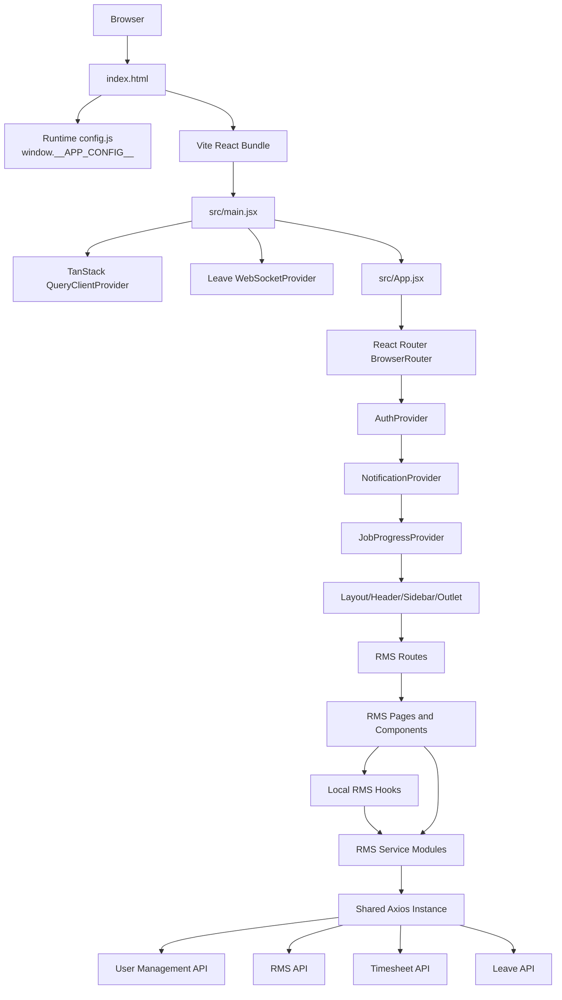
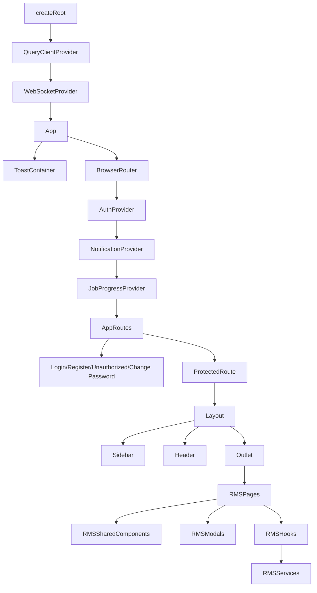
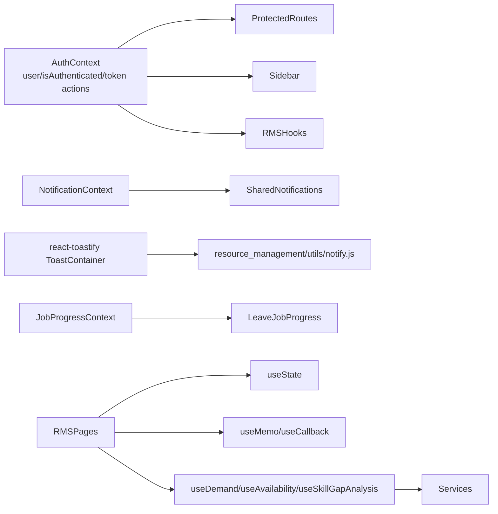
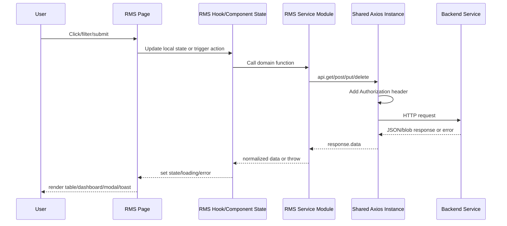
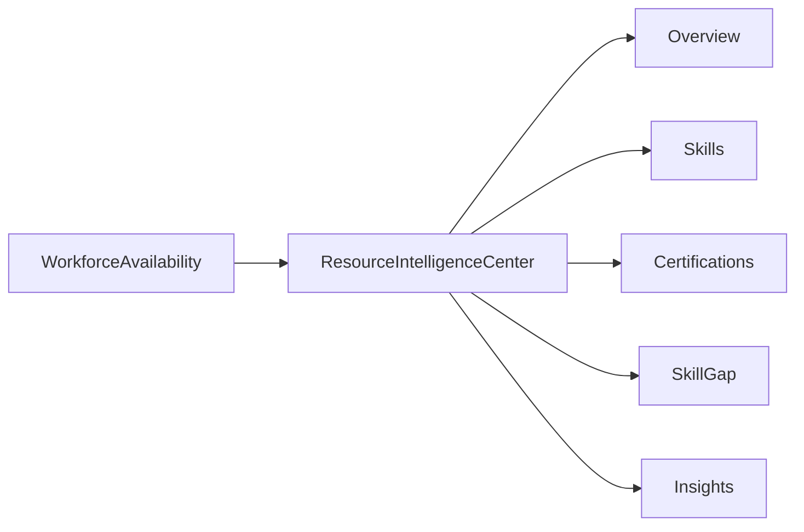
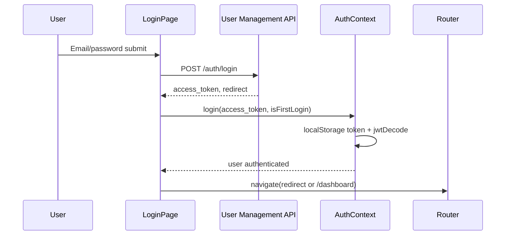
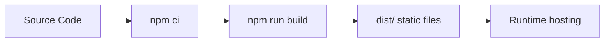
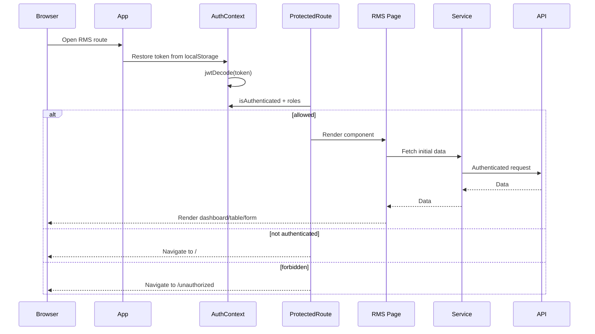
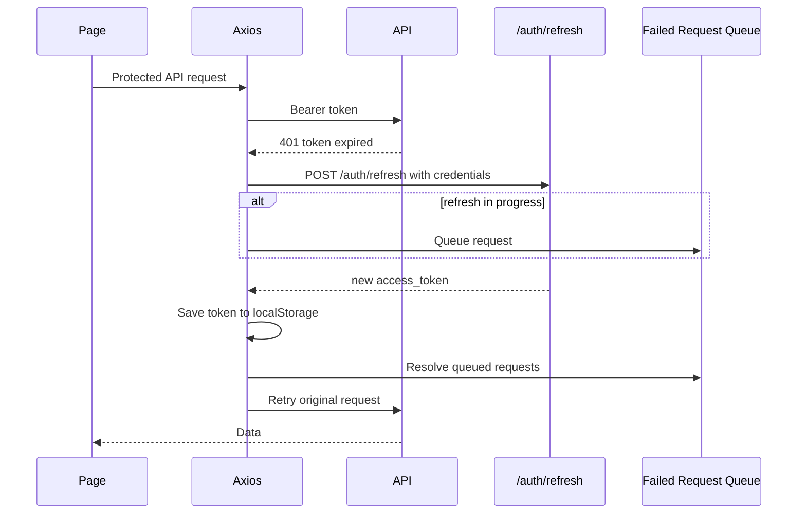

# Resource Management System Frontend Technical Design Document

## 1. Introduction

### Purpose of the Frontend Application

The React application is the frontend for the Paves Intranet portal. Within that portal, the Resource Management System (RMS) module supports resource planning, client and asset management, demand lifecycle management, workforce availability, role-off approvals, bench management, and utilization reporting.

The frontend provides authenticated users with role-aware navigation, protected RMS routes, form-driven workflows, tabular and dashboard views, and API communication with RMS, Timesheet, Leave Management, and User Management backend services.

### Scope

This document covers only the frontend application under `intranet-fe`, with emphasis on the RMS module under `src/pages/resource_management`. It also documents shared frontend infrastructure used by RMS, including routing, authentication, Axios, layout, notification handling, runtime configuration, and deployment files.

Out of scope: backend implementation, database design, backend authorization enforcement, backend deployment internals, and non-RMS functional details except where shared frontend infrastructure is used by RMS.

### Key User Roles Supported

The RMS frontend explicitly supports the following roles in route protection, sidebar visibility, and module logic:

- `Admin`
- `Super_Admin`
- `Resource_Manager`
- `Delivery_Manager`
- `Project_Manager`

Additional portal roles appear in shared routing and layout code: `General`, `HR`, `Manager`, `Hr-Manager`, `Reporting_Manager`, `Employee`, and `Tester`.

## 2. Frontend Architecture Overview

### High-Level Frontend Architecture Diagram



### Application Flow

1. `index.html` loads `/config.js`, which defines `window.__APP_CONFIG__`.
2. `src/main.jsx` creates the React root and wraps the app with:
   - `QueryClientProvider`
   - `WebSocketProvider`
   - `App`
3. `src/App.jsx` configures:
   - `BrowserRouter` with `basename={window.__APP_CONFIG__.basePath}`
   - `AuthProvider`
   - `NotificationProvider`
   - `JobProgressProvider`
   - `Routes`
4. Public users land on `/`, which renders `LoginPage`.
5. After login, `AuthContext.login()` stores the access token in `localStorage` and decodes the JWT into user state.
6. Protected routes render the shared `Layout`, which includes `Sidebar`, `Header`, and route `Outlet`.
7. RMS pages call RMS service modules or hooks, which call the shared Axios instance.
8. Axios adds `Authorization: Bearer <token>` to protected requests and attempts refresh on expired-token 401 responses.

### Component Hierarchy



### Module-Wise Breakdown

| Module | Code Location | Purpose |
|---|---|---|
| App bootstrap | `src/main.jsx`, `src/App.jsx` | Provider composition, routing, global toast containers. |
| Authentication | `src/contexts/AuthContext.jsx`, `src/pages/LoginPage.jsx`, `src/api/axiosInstance.js` | Login, OAuth callback, JWT decode, session restore, logout, token refresh. |
| Layout/navigation | `src/components/Layout` | Sidebar/header shell and role-aware navigation. |
| RMS admin/client | `src/pages/resource_management/pages/admin`, `models/ClientPage.jsx`, `models/CreateClient.jsx`, `services/clientservice.js` | Client dashboard, client records, SLA/compliance/escalation/contact/assets. |
| RMS projects | `src/pages/resource_management/pages/project`, `services/projectService.js` | Project list/details, readiness, demand creation, project SLA/compliance/escalations. |
| Workforce availability | `src/pages/resource_management/pages/workforce`, `components/Availability*`, `hooks/useAvailability.js`, `services/workforceService.js` | Resource availability calendar/timeline, filters, KPIs, detail panel. |
| Resource intelligence | `src/pages/resource_management/components/resource-intelligence` | Lazy-loaded resource profile tabs: overview, skills, certifications, skill gap, insights. |
| Demand management | `src/pages/resource_management/demand` | Role-scoped demand workspace, demand detail, allocation, modification, approval/fulfillment actions. |
| Role-off management | `src/pages/resource_management/pages/roleoff`, `roleoff`, `services/roleOffService.js` | PM/RM/DM role-off workspaces, approvals, bulk actions, reports/export. |
| Bench management | `src/pages/resource_management/bench` | Bench/pool resources, quick allocation, resource state, bench pool report, utilization dashboards. |
| Shared RMS utilities | `src/pages/resource_management/hooks`, `services`, `utils`, `constants` | Domain hooks, API services, enums, notification helpers. |

### Routing Architecture

The application uses `react-router-dom` version `^7.7.0`. Main routing is declared in `src/App.jsx`. RMS routes are nested under the shared authenticated `Layout`.

RMS routes identified in code:

| Route | Component | Protection |
|---|---|---|
| `/resource-management` | `AdminPannel` | `Admin`, `Resource_Manager` |
| `/resource-management/bench` | `BenchPage` | `Admin`, `Resource_Manager` |
| `/resource-management/bench/report` | `BenchPoolDashboard` | `Admin`, `Resource_Manager` |
| `/resource-management/bench/utilization-performance` | `UtilizationPerformanceDashboard` | `Admin`, `Resource_Manager` |
| `/resource-management/bench/utilization-performance/projects/:projectId` | `OperationalProjectDetailPage` | `Admin`, `Resource_Manager` |
| `/resource-management/bench/utilization-reporting` | `UtilizationReportingDashboard` | `Admin`, `Resource_Manager` |
| `/resource-management/client-details/:clientId` | `ClientPage` | `General`, `HR`, `Manager`, `Hr-Manager` |
| `/assets/:clientId/:assetId` | `AssetDetail` | `General`, `HR`, `Manager`, `Hr-Manager` |
| `/manage-assets/:clientId` | `AssetList` | `General`, `HR`, `Manager`, `Hr-Manager` |
| `/resource-management/projects` | `RMSProjectList` | Inside authenticated layout, no route-level RMS role wrapper in current code |
| `/resource-management/projects/:projectId` | `RMSProjectDetails` | Inside authenticated layout, no route-level RMS role wrapper in current code |
| `/resource-management/workforce-availability` | `WorkforceAvailability` | Inside authenticated layout, no route-level RMS role wrapper in current code |
| `/resource-management/workforce-availability/resource/:resourceId` | `ResourceIntelligenceCenter` | Inside authenticated layout, no route-level RMS role wrapper in current code |
| `/resource-management/demand` | `DemandWorkspacePage` | `Resource_Manager`, `Delivery_Manager`, `Admin`, `Super_Admin` |
| `/resource-management/demand/:demandId` | `DemandDetailPage` | `Resource_Manager`, `Delivery_Manager`, `Admin`, `Super_Admin` |
| `/resource-management/roleoff` | `RoleOffEntry` | `Project_Manager`, `Resource_Manager`, `Delivery_Manager`, `Admin`, `Super_Admin` |
| `/resource-management/roleoff/pm` | `PMRoleOffPage` | `Project_Manager` |
| `/resource-management/roleoff/rm` | `RMRoleOffPage` | `Resource_Manager` |
| `/resource-management/roleoff/dm` | `DMRoleOffPage` | `Delivery_Manager` |
| `/resource-management/roleoff/report` | `RoleOffDashboard` | `Project_Manager`, `Resource_Manager`, `Delivery_Manager` |

`RoleOffEntry` redirects by role:

- `Delivery_Manager` -> `/resource-management/roleoff/dm`
- `Resource_Manager` -> `/resource-management/roleoff/rm`
- otherwise -> `/resource-management/roleoff/pm`

### State Management Architecture

The RMS frontend primarily uses React local state and custom hooks. Global state is limited to shared contexts.



Identified state patterns:

- `AuthContext` stores decoded JWT user and authentication status.
- `useDemand` owns filters, tabs, pagination, role selection, demand list, KPI data, and derived filtered data.
- `useAvailability` owns filters, current calendar window, pagination, selected resource, active view, loading state, and derived KPI data.
- `useSkillGapAnalysis` owns selected demand, demand search, analysis loading/error/result.
- Several RMS components use `useMemo` for filtering, sorting, pagination, chart data, and row projections.
- TanStack Query is configured globally in `main.jsx`, but RMS code observed here mostly uses custom hooks and direct service calls rather than React Query hooks.
- Zustand is listed in dependencies and used elsewhere in the project (`Projects/MyWork`), but no RMS Zustand store was identified.

### API Communication Flow



## 3. Technology Stack

### React Version

`react`: `^18.3.1`  
`react-dom`: `^18.3.1`

### JavaScript/TypeScript Details

- Package type: ESM via `"type": "module"`.
- Main app files are JavaScript/JSX.
- TypeScript is installed (`typescript`, `typescript-eslint`) and the repo includes at least one TS file (`src/pages/Projects/types/index.ts`), but RMS files reviewed are JS/JSX.
- Vite React plugin is configured to include `.jsx` and `.js`.

### UI Libraries and Frameworks

- Tailwind CSS `^3.4.17`
- `@tailwindcss/forms`
- Headless UI `@headlessui/react`
- Ant Design `antd`
- Lucide icons `lucide-react`
- Heroicons `@heroicons/react`
- React Icons `react-icons`
- Recharts, Chart.js, React Chart.js 2
- Framer Motion / Motion
- React Datepicker / React Day Picker
- FullCalendar
- Local shared UI components under `src/components/ui`

### Routing Libraries

- `react-router-dom` `^7.7.0`

### State Management Libraries

- React Context: actively used for auth, notifications, job progress.
- TanStack Query: configured globally with retry `2` and stale time `60_000`.
- Zustand: installed, but no RMS-specific Zustand store identified.

### Form Handling Libraries

- React local state is used in RMS forms and modals.
- `react-hook-form` and `@hookform/resolvers` are installed, but RMS code reviewed uses custom validation/local state rather than React Hook Form.

### Validation Libraries

- `yup` is installed.
- RMS validation identified in code is custom/manual validation in components such as `DemandModal`, `AllocationModal`, `CreateModificationModal`, `RoleOffDrawer`, and `UpdateProjectStatusModal`.

### Build Tools

- Vite `^7.3.2`
- `@vitejs/plugin-react`
- ESLint `^9.9.1`
- PostCSS / Autoprefixer
- Tailwind CSS

### Package Dependencies

The complete dependency list is defined in `package.json`. Major runtime categories:

- API/data: `axios`, `@tanstack/react-query`
- Auth/token: `jwt-decode`
- UI: `antd`, `@headlessui/react`, `lucide-react`, `@heroicons/react`, `react-icons`
- Charts: `recharts`, `chart.js`, `react-chartjs-2`
- Dates/calendar: `date-fns`, `react-datepicker`, `react-day-picker`, `@fullcalendar/*`
- Forms/files: `react-hook-form`, `yup`, `xlsx`, `exceljs`, `papaparse`, `file-saver`, `docx`, `jspdf`
- Realtime: `sockjs-client`, `stompjs`, `@stomp/stompjs`
- Interaction: `@hello-pangea/dnd`, `react-dnd`, `react-window`

## 4. Project Structure

### Complete Folder Structure

The complete frontend source is broad. The RMS-relevant and shared frontend structure identified from the repo is:

```text
intranet-fe/
  Dockerfile
  Jenkinsfile
  docker-entrypoint.sh
  nginx.conf
  index.html
  package.json
  vite.config.js
  tailwind.config.js
  postcss.config.js
  eslint.config.js
  public/
    logo.png
  src/
    App.jsx
    main.jsx
    index.css
    api/
      axiosInstance.js
    config/
      sidebarConfig.js
    contexts/
      AuthContext.jsx
      JobProgressContext.jsx
      NotificationContext.jsx
    lib/
      utils.js
    utils/
      sidebarPermissions.js
    services/
      accessPointService.js
      dashboard.js
      Permissionapi.js
      roleManagementService.js
      skillService.js
      utilizationService.js
    components/
      Button/
      Cards/
      confirmation_modal/
      filter/
      Fonts/
      forms/
      icons/
      kpi/
      Layout/
      List/
      Modal/
      modals/
      Navbar/
      Pagination/
      status/
      Table/
      toastfy/
      ui/
      LoadingSpinner.jsx
      ProtectedRoute.jsx
      ToastNotifications.jsx
    pages/
      Dashboard.jsx
      Calendar.jsx
      LoginPage.jsx
      Unauthorized.jsx
      resource_management/
        assests/
          AssetDetail.jsx
          AssetList.jsx
        bench/
          components/
          constants/
          models/
          pages/
          services/
        components/
          filters/
          resource-intelligence/
          ui/
          AvailabilityCalendar.jsx
          AvailabilityKPIs.jsx
          AvailabilityTimeline.jsx
          ClientCard.jsx
          ClientStatusBadge.jsx
          ClientStatusControl.jsx
          ClientTable.jsx
          DashboardHeader.jsx
          FilterBar.jsx
          FinancialModal.jsx
          ProjectKPIs.jsx
          ResourceDetailPanel.jsx
          ResourceList.jsx
          ResourceTable.jsx
        constants/
          enumsData.js
        demand/
          components/
          hooks/
          pages/
          services/
          utils/
        hooks/
          useAvailability.js
          useEnums.js
          usehooksExample.jsx
          useSkillGapAnalysis.js
        models/
          client_configuration/
          skill_management/
          AddDeliverableRoleModal.jsx
          availabilityModel.js
          ClientBasicCompliance.jsx
          ClientBasicSLA.jsx
          ClientEscalationContact.jsx
          ClientEscalationSection.jsx
          ClientPage.jsx
          ClientSection.jsx
          CompanyEscalation.jsx
          CreateClient.jsx
          DemandModal.jsx
          RoleExpectations.jsx
          UpdateProjectStatusModal.jsx
        pages/
          admin/
          project/
          roleoff/
          workforce/
        projects/
          mockData.js
        roleoff/
          ApprovalDrawer.jsx
          BulkActionBar.jsx
          CancelRoleOffModal.jsx
          KPISection.jsx
          RoleOffDrawer.jsx
          RoleOffFilterPanel.jsx
          RoleOffSidePanel.jsx
          RoleOffSummaryCard.jsx
          RoleOffTable.jsx
          RoleOffWorkspace.jsx
        services/
          availabilityService.js
          clientservice.js
          demandService.js
          projectService.js
          resource.js
          roleOffService.js
          utilizationService.js
          workforceService.js
        utils/
          notify.js
```

### Purpose of Each Major Folder

| Folder | Purpose |
|---|---|
| `src/api` | Shared Axios instance and token refresh behavior. |
| `src/contexts` | Global React contexts for auth, notification, and job progress. |
| `src/components` | Shared layout, UI, forms, tables, modals, cards, icons, filters, and toasts. |
| `src/config` | Sidebar role/menu configuration. |
| `src/services` | Shared portal services used across modules, including skill and utilization services used by RMS-like workflows. |
| `src/pages/resource_management` | RMS feature implementation. |
| `src/pages/resource_management/services` | RMS domain API functions for clients, projects, resources, workforce, role-off, demand, utilization. |
| `src/pages/resource_management/demand` | Demand workspace, detail pages, allocation/modification components, hooks, and services. |
| `src/pages/resource_management/bench` | Bench and utilization pages, service calls, resource/pool components. |
| `src/pages/resource_management/roleoff` | Shared role-off workspace components used by PM/RM/DM route entry files. |
| `src/pages/resource_management/models` | RMS modal-like and domain UI models for clients, assets, demands, skill taxonomy, configuration forms. |
| `src/pages/resource_management/hooks` | RMS custom hooks for availability and resource intelligence. |

### Reusable Components Architecture

Shared reusable components include:

- Layout: `Layout`, `Sidebar`, `Header`
- Common UI primitives: `button`, `input`, `select`, `tabs`, `sheet`, `tooltip`, `badge`, `avatar`, `Modal`, `Loader`
- Tables and pagination: `components/Table/table.jsx`, `components/Pagination/pagination.jsx`
- Cards/KPIs: `components/Cards/*`, `components/kpi/KPI.jsx`, RMS `AvailabilityKPIs`, `ProjectKPIs`, `BenchKPI`, `KPISection`
- Forms: `FormInput`, `FormSelect`, `FormTextArea`, `FormDatePicker`, `FileUpload`, plus RMS-specific modal forms
- Notifications: `components/toastfy/toast.jsx`, `NotificationContext`, RMS `utils/notify.js`
- Icons: shared SVG/component icon libraries and third-party icon libraries

RMS also has domain-specific reusable components for:

- Client dashboard/table/card/status
- Availability calendar/timeline/filter/detail views
- Demand filter, KPI, badges, list rows, allocation modals
- Role-off table, drawers, approval panels, bulk action bars
- Bench tables, drawers, filters, allocation modals, visualizations
- Resource intelligence tabs

### Context Providers

| Provider | File | Responsibility |
|---|---|---|
| `AuthProvider` | `src/contexts/AuthContext.jsx` | Stores decoded user, auth status, login/logout, role helpers. |
| `NotificationProvider` | `src/contexts/NotificationContext.jsx` | Local notification stack with auto-removal after 3 seconds. |
| `JobProgressProvider` | `src/contexts/JobProgressContext.jsx` | Used by leave balance job progress overlay. |
| `QueryClientProvider` | `src/main.jsx` | TanStack Query global client with retry/staleTime defaults. |
| `WebSocketProvider` | `src/pages/leave_management/websockets/WebSocketProvider.jsx` | Mounted globally, although it belongs to leave management. |

### Services Layer

RMS service files call backend APIs through `src/api/axiosInstance.js`. Most services build full URLs from runtime config values:

- `window.__APP_CONFIG__.RMS_BASE_URL`
- `window.__APP_CONFIG__.TIMESHEET_API_ENDPOINT`
- `window.__APP_CONFIG__.BASE_URL`

Service responsibilities:

- `clientservice.js`: clients, client SLA/compliance/escalations, assets, asset assignments, company contacts, project related client data.
- `projectService.js`: project listing/details, demand creation checks, demand creation, readiness status, locations, KPIs.
- `resource.js`: resources and allocations.
- `workforceService.js`: workforce filters, availability KPI/timeline, holidays, utilization, dashboard summaries, skill category tree, role expectations, skill gap.
- `demandService.js`: older/admin demand operations such as update, delete, role expectation update.
- `demand/services/demandService.js`: role-scoped enterprise demand workspace operations.
- `demand/services/allocationModificationApi.js`: PM allocation modification requests and RM decisions.
- `roleOffService.js`: PM create/cancel, RM approve/reject, DM fulfill/reject, bulk actions, role-off reports/export.
- `bench/services/benchService.js`: bench/pool resources, KPIs, status update, matches, quick allocation, reports/export.
- `bench/services/operationalProjectsService.js`: Timesheet-backed project hours summary.
- `utilizationService.js`: Timesheet-backed utilization dashboard and export APIs.

### Utility Functions

- `src/lib/utils.js`: `cn(...inputs)` wrapper around `classnames`.
- `src/utils/sidebarPermissions.js`: recursive role-based menu filtering.
- `src/pages/resource_management/utils/notify.js`: RMS notification wrapper around `react-toastify`, including error message extraction.
- `src/pages/resource_management/demand/utils/demandPermissions.js`: demand status and PM edit/delete permission helpers.
- `src/pages/resource_management/models/availabilityModel.js` and `services/availabilityService.js`: availability status and derived KPI/calendar helpers.

## 5. User Interface Modules

### Client Management

Purpose: Manage RMS client data, admin KPIs, client records, SLA, compliance, escalation contacts, company contacts, assets, and asset assignments.

Components/pages:

- `AdminPannel`
- `ClientPage`
- `ClientSection`
- `CreateClient`
- `ClientBasicSLA`
- `ClientBasicCompliance`
- `ClientEscalationContact`
- `ClientEscalationSection`
- `ClientTable`
- `ClientCard`
- `ClientStatusBadge`
- `ClientStatusControl`
- `AssetList`
- `AssetDetail`
- `FinancialModal`
- Client configuration modals/forms under `models/client_configuration`

Navigation flow:

```mermaid
flowchart LR
  Sidebar --> ClientManagement[/resource-management/]
  ClientManagement --> ClientDetails[/resource-management/client-details/:clientId]
  ClientDetails --> ManageAssets[/manage-assets/:clientId]
  ManageAssets --> AssetDetail[/assets/:clientId/:assetId]
```

API integrations:

- `/api/client/get-admin-kpi`
- `/api/client/search`
- `/api/client/create`
- `/api/client/get-all-clients`
- `/api/client/{clientId}`
- `/api/client/update-client`
- `/api/client/delete-client/{clientId}`
- `/api/client/{clientId}/page-data`
- `/api/client-sla/*`
- `/api/client-compliance/*`
- `/api/client-contact/*`
- `/api/client-assets/*`
- `/api/client-asset-assignments/*`
- `/api/company-contact/*`

### Resource Project Management

Purpose: Display RMS project list/details, readiness status, project KPIs, project SLA/compliance/escalations, overlaps, and demand creation from projects.

Components/pages:

- `RMSProjectList`
- `RMSProjectDetails`
- `ProjectResourcesTable`
- `ProjectKPIs`
- `DemandModal`
- `UpdateProjectStatusModal`
- `AddDeliverableRoleModal`
- Client configuration forms reused for project SLA/compliance/escalation.

Navigation flow:

```mermaid
flowchart LR
  Sidebar --> ProjectList[/resource-management/projects]
  ProjectList --> ProjectDetails[/resource-management/projects/:projectId]
  ProjectDetails --> DemandModal[Create/Edit Demand Modal]
  ProjectDetails --> ProjectConfig[Project SLA/Compliance/Escalations]
```

API integrations:

- `/api/projects/get-projects`
- `/api/projects/get-project-by-id/{projectId}`
- `/api/projects/check-demand-creation/{projectId}`
- `/api/projects/readiness-status-update`
- `/api/projects/get-locations`
- `/api/projects/kpi`
- `/api/projects/{projectId}/overlaps`
- `/api/projects/{projectId}/escalations`
- `/api/projects/escalations/save`
- `/api/projects/update-escalation/{id}`
- `/api/projects/delete-escalation/{id}`
- `/api/project-sla/*`
- `/api/project-compliance/*`
- `/api/demand/create`
- `/api/demand/update/pm`

### Workforce Availability

Purpose: Show resource availability by calendar/timeline, support filters, derived KPIs, selected resource details, and drill-down into resource intelligence.

Components/pages:

- `WorkforceAvailability`
- `AvailabilityFilters`
- `AvailabilityCalendar`
- `AvailabilityTimeline`
- `AvailabilityKPIs`
- `ResourceList`
- `ResourceTable`
- `ResourceDetailPanel`
- `FilterBar`
- `useAvailability`

Navigation flow:

```mermaid
flowchart LR
  Sidebar --> Workforce[/resource-management/workforce-availability]
  Workforce --> Calendar[Calendar View]
  Workforce --> Timeline[Timeline View]
  Workforce --> DetailPanel[Resource Detail Panel]
  Workforce --> Intelligence[/resource-management/workforce-availability/resource/:resourceId]
```

API integrations:

- `/api/resource/get-all-resource-filters`
- `/api/rms/kpis`
- `/api/availability/timeline/window`
- Leave API `/api/holidays/year/{year}`
- Timesheet API `/api/utilization/monthly/{resourceId}`
- Timesheet API `/api/dashboard/summary`
- Timesheet API `/api/dashboard/summary/dateRangeMonths`

### Resource Intelligence

Purpose: Provide a drill-down resource profile with overview, skill inventory, certification inventory, skill gap analysis, and insights.

Components/pages:

- `ResourceIntelligenceCenter`
- Lazy-loaded tabs:
  - `OverviewTab`
  - `SkillsTab`
  - `CertificationsTab`
  - `SkillGapTab`
  - `InsightsTab`
- `useSkillGapAnalysis`

Navigation flow:



API integrations:

- `/api/demand/rm/demands`
- `/api/matching/skill-gap-analysis`
- skill/certification data through resource/client services where used.

### Demand Management

Purpose: Role-scoped demand workspace for Resource Managers, Delivery Managers, Admins, Super Admins, and project-related demand views. Supports KPI tabs, filters, demand decisions, fulfillment, delete, allocation, and modification workflows.

Components/pages:

- `DemandWorkspacePage`
- `DemandDetailPage`
- `DemandList`
- `DemandFilters`
- `DemandFilterPanel`
- `DemandKPIStrip`
- `DemandCardRow`
- `DemandBadges`
- `FormalBadges`
- `AllocationModal`
- `AllocationModificationTab`
- `CreateModificationModal`
- `DeleteDemandModal`
- `ModificationTable`
- `RejectModificationModal`
- `useDemand`

Navigation flow:

```mermaid
flowchart LR
  Sidebar --> DemandWorkspace[/resource-management/demand]
  DemandWorkspace --> DemandFilters[Filter/Search/Tab Selection]
  DemandWorkspace --> DemandDetail[/resource-management/demand/:demandId]
  DemandWorkspace --> DMDecision[DM Decision]
  DemandWorkspace --> RMDecision[RM Decision/Fulfillment]
  DemandDetail --> Allocation[Allocation Modal]
  DemandDetail --> Modification[Allocation Modification Tab]
```

API integrations:

- `/api/demand/demands`
- `/api/demand/{id}`
- `/api/demand/kpi`
- `/api/demand/dashboard-kpi`
- `/api/demand/created-by-me`
- `/api/demand/project/{projectId}`
- `/api/demand/pm/kpi`
- `/api/demand/rm/kpi`
- `/api/demand/rm/demands`
- `/api/demand/dm/kpi`
- `/api/demand/dm/demands`
- `/api/demand/dm/decision`
- `/api/demand/rm/decision`
- `/api/demand/delete/pm/{demandId}`
- `/api/allocation-modifications/*`

### Role-Off Management

Purpose: PM role-off creation/cancellation, RM approvals/rejections, DM fulfillment/rejection, bulk actions, status dashboards, and export.

Components/pages:

- `pm.js`, `rm.js`, `dm.js`
- `RoleOffDashboard`
- `RoleOffWorkspace`
- `RoleOffTable`
- `RoleOffDrawer`
- `RoleOffSidePanel`
- `RoleOffFilterPanel`
- `RoleOffSummaryCard`
- `ApprovalDrawer`
- `BulkActionBar`
- `CancelRoleOffModal`
- `KPISection`

Navigation flow:

```mermaid
flowchart LR
  RoleOffEntry[/resource-management/roleoff] --> PM[/resource-management/roleoff/pm]
  RoleOffEntry --> RM[/resource-management/roleoff/rm]
  RoleOffEntry --> DM[/resource-management/roleoff/dm]
  PM --> CreateRoleOff[Create/Cancel]
  RM --> ApproveReject[RM Approve/Reject]
  DM --> FulfillReject[DM Fulfill/Reject]
  PM --> Report[/resource-management/roleoff/report]
  RM --> Report
  DM --> Report
```

API integrations:

- `/api/role-off/get-resources/{projectId}`
- `/api/role-off/get-role-off-project-kpi/{projectId}`
- `/api/role-off/approved-today`
- `/api/role-off`
- `/api/role-off/bulk-planned`
- `/api/role-off/{id}/pm-cancel`
- `/api/role-off/{id}/rm-approve`
- `/api/role-off/{id}/rm-reject`
- `/api/role-off/bulk-rm-approve`
- `/api/role-off/bulk-rm-reject`
- `/api/role-off/{id}/dl-fulfill`
- `/api/role-off/{id}/dl-reject`
- `/api/role-off/bulk-dl-fulfill`
- `/api/role-off/bulk-dl-reject`
- `/api/role-off/reasons`
- `/api/role-off/get-role-off-rm`
- `/api/role-off/pending-dm-action`
- `/api/role-off/fulfilled-dm-action`
- `/api/reports/role-off/filtered`
- `/api/reports/role-off/export/csv`

### Bench Management

Purpose: Manage resources on bench and in pool, inspect bench KPIs, match resources to demands, perform quick allocation, move resources between states, and generate bench reports.

Components/pages:

- `BenchPage`
- `BenchPoolDashboard`
- `BenchTable`
- `BenchRow`
- `BenchFilters`
- `BenchDrawer`
- `ResourceDrawer`
- `ResourceVisualizationDrawer`
- `AllocateModal`
- `QuickAllocateModal`
- `MoveToPoolModal`
- `BenchKPI`
- `StatusIndicator`
- `UtilizationNavbar`

Navigation flow:

```mermaid
flowchart LR
  Sidebar --> Bench[/resource-management/bench]
  Bench --> BenchTable
  Bench --> BenchDrawer
  Bench --> QuickAllocate
  Bench --> MoveToPool
  Bench --> BenchReport[/resource-management/bench/report]
```

API integrations:

- `/api/bench/bench-resources`
- `/api/bench/pool-resources`
- `/api/bench/kpi`
- `/api/bench/update-resource-state`
- `/api/bench/matches`
- `/api/demand/rm/demands`
- `/api/bench/quick-allocate`
- `/api/reports/bench-pool`
- `/api/reports/bench-pool/export`

### Utilization and Performance

Purpose: Show utilization dashboards and operational project hours based on Timesheet service data.

Components/pages:

- `UtilizationPerformanceDashboard`
- `OperationalProjectDetailPage`
- `UtilizationReportingDashboard`
- Additional utilization pages present under `bench/pages`: portfolio, governance, projects, resource dashboards.

Navigation flow:

```mermaid
flowchart LR
  Sidebar --> Utilization[/resource-management/bench/utilization-performance]
  Utilization --> ProjectDetail[/resource-management/bench/utilization-performance/projects/:projectId]
  Sidebar --> UtilReporting[/resource-management/bench/utilization-reporting]
```

API integrations:

- Timesheet API `/api/timesheets/RMS/project-hours-summary`
- Timesheet API `/api/timesheets/RMS/project-hours-summary/{projectId}`
- Timesheet API `/api/utilization/summary`
- Timesheet API `/api/utilization/trends`
- Timesheet API `/api/utilization/resources`
- Timesheet API `/api/utilization/projects`
- Timesheet API `/api/utilization/clients`
- Timesheet API `/api/utilization/roles`
- Timesheet API `/api/utilization/analytics`
- Timesheet API `/api/utilization/alerts`
- Timesheet API `/api/utilization/export/csv`
- Timesheet API `/api/utilization/export/excel`
- Timesheet API `/api/timesheets/RMS/users`

## 6. Authentication and Authorization

### Login Flow



Microsoft login flow:

1. `LoginPage.handleMicrosoftLogin()` sets `window.location.href` to `${USER_MANAGEMENT_URL}/auth/ms-login`.
2. The OAuth callback returns to the app with `?code=...`.
3. `LoginPage` calls `GET /auth/callback?code=...` with `withCredentials: true`.
4. The response access token is stored via `AuthContext.login()`.
5. The app navigates to the backend-provided redirect or `/dashboard`.

Forgot password flow:

- `POST /auth/send-otp`
- `POST /auth/forgot-password`

### JWT Handling

- Access token key: `localStorage["token"]`.
- `AuthContext.loadUser(token)` decodes the token with `jwtDecode` and stores decoded user data in React state.
- Token expiration is observed on mount, but expired tokens are not immediately logged out; Axios refresh handles actual renewal.
- `AuthContext.logout()` calls `POST /auth/logout` with the bearer token, then clears local token and user keys.

### Protected Routes

Two `ProtectedRoute` implementations exist:

1. Inline `ProtectedRoute` inside `src/App.jsx`
   - Checks `isAuthenticated`.
   - Supports `allowedRoles`.
   - Redirects unauthorized users to `/unauthorized`.
   - Handles `isfirsttlogin` by logging out and redirecting to `/`.

2. `src/components/ProtectedRoute.jsx`
   - Checks `isAuthenticated`.
   - Supports `roles`.
   - Redirects unauthorized users to `/unauthorized`.

Important code observation: some nested employee-onboarding route elements use `roles={...}` while the inline `ProtectedRoute` in `App.jsx` expects `allowedRoles`. For RMS routes in `App.jsx`, the code uses `allowedRoles` consistently where a role wrapper is present.

### Role-Based Access Control Implementation

RBAC is implemented in three frontend locations:

- Route wrappers in `src/App.jsx`
- Sidebar visibility in `src/components/Layout/Sidebar.jsx`
- Domain-specific checks, for example `demand/utils/demandPermissions.js`

Sidebar RMS role behavior:

- `Admin` sees Resource Management.
- `Resource_Manager` sees RMS submenu.
- `Delivery_Manager` sees only Demand Management and Role-Off Management in RMS submenu.
- Project Manager-specific RMS sidebar link code exists as a commented block and is not active.

### Session Management

- On app mount, `AuthContext` reads `localStorage["token"]` and restores user state if JWT decode succeeds.
- `SaveLastPath` stores the current path in `localStorage["lastPath"]` for non-login routes.
- `AppRoutes` redirects authenticated users from `/` or `/login` to `lastPath`, `/change-password`, `/resource-management/demand` for Delivery Managers, or `/dashboard`.
- Refresh token behavior uses `POST /auth/refresh` with `withCredentials: true`; refresh token itself is not stored in frontend code reviewed.

## 7. API Integration Layer

### Backend Service Endpoints Consumed

Runtime service base URLs:

| Config key | Used for |
|---|---|
| `USER_MANAGEMENT_URL` | Login, OAuth callback, logout, token refresh, shared Axios base URL. |
| `RMS_BASE_URL` | RMS clients, projects, resources, demand, role-off, bench, skill APIs. |
| `TIMESHEET_API_ENDPOINT` | Utilization, project hours, RMS users, dashboard summaries. |
| `BASE_URL` | Leave/holiday APIs used by workforce availability. |
| `PMS_BASE_URL` | Project Management service used by dashboard services outside RMS. |
| `EMPLOYEE_ONBOARDING_URL` | Employee onboarding services outside RMS. |
| `MSOffice_USER_MANAGEMENT_URL` | Defined in runtime config, usage not identified in reviewed RMS paths. |

RMS endpoint groups are documented in section 5 by module.

### Axios/Fetch Configuration

Shared Axios instance: `src/api/axiosInstance.js`

- `baseURL`: `window.__APP_CONFIG__.USER_MANAGEMENT_URL`
- default `Content-Type`: `application/json`
- `withCredentials: true`
- Request interceptor injects bearer token for non-public URLs.
- FormData requests remove explicit `Content-Type` to let the browser set multipart boundaries.

No native `fetch` usage was identified in active RMS API services reviewed; API calls use Axios.

### Request Interceptors

The request interceptor:

- Skips auth injection for public auth URLs:
  - `/auth/login`
  - `/auth/ms-login`
  - `/auth/callback`
  - `/auth/send-otp`
  - `/auth/forgot-password`
  - `/auth/refresh`
- Reads token from `localStorage["token"]`.
- Adds `Authorization: Bearer <token>`.
- Removes JSON content-type when `config.data instanceof FormData`.

### Response Interceptors

The response interceptor:

- Passes successful responses through unchanged.
- On `401` where response detail/message includes token expiry text:
  - queues concurrent failed requests while one refresh is active;
  - calls `POST /auth/refresh` using a separate Axios client;
  - stores the new access token;
  - retries original and queued requests.
- Does not refresh for public URLs or already retried requests.
- On refresh failure, clears tokens only if the latest token is missing, then redirects to `/login`.

### Error Handling Strategy

Identified strategy:

- Service functions generally `throw error` after logging or return fallback values in selected dashboard functions.
- RMS notification helper extracts useful messages from `error.response.data.message`, `detail`, `error`, `description`, nested `data`, and `errors`.
- Components call `notify.error(...)`, `notify.success(...)`, or use `showStatusToast`.
- Some APIs return `null` or `[]` fallback for KPI/report scenarios to keep dashboards renderable.

## 8. Environment Configuration

### Environment Variables Used

The frontend does not use `import.meta.env.VITE_*` for these runtime APIs. Runtime configuration is generated into `/config.js` and read from `window.__APP_CONFIG__`.

`docker-entrypoint.sh` writes:

```js
window.__APP_CONFIG__ = {
  TIMESHEET_API_ENDPOINT,
  USER_MANAGEMENT_URL,
  BASE_URL,
  PMS_BASE_URL,
  MSOffice_USER_MANAGEMENT_URL,
  EMPLOYEE_ONBOARDING_URL,
  RMS_BASE_URL
};
```

Default values in Docker entrypoint point to `http://13.204.95.26` with service-specific ports.

### Development Configuration

- `npm run dev` starts Vite.
- `index.html` still expects `/config.js`; development requires that file to be available at the dev server root or provided externally.
- Vite config uses base `/` and alias `@` -> `./src`.

### Production Configuration

Two production strategies are present:

- Docker/Nginx:
  - Build with `npm ci` and `npm run build`.
  - Serve `dist` from Nginx.
  - Generate `/config.js` at container startup from environment variables.
- Jenkins/S3/CloudFront:
  - `Jenkinsfile` calls `buildFrontendPipeline`.
  - Uses AWS Secrets Manager secret `intranet/frontend/runtime-dev`.
  - Deploys `dist` to S3 bucket `paves-intranet-testing-dev`.
  - Invalidates/serves via CloudFront ID `E1QTJRU34QZ161`.
  - AWS region `ap-south-1`.

### Build-Time Variables

No RMS-specific build-time variables were identified. Backend endpoints are runtime variables, not Vite build-time variables.

## 9. Frontend Security Measures

### Authentication Security

- Access token is sent as a bearer token for protected API calls.
- Refresh call uses `withCredentials: true`, indicating refresh credentials may be cookie-backed by backend.
- Logout calls backend `/auth/logout` with bearer token before clearing client state.
- Invalid/tampered token decode triggers logout and toast.

### Authorization Controls

- Frontend route guards block unauthorized route rendering.
- Sidebar hides menu items based on roles.
- Demand helper restricts Project Manager edit/delete behavior to DRAFT/REQUESTED states.

Frontend authorization is a UX and routing control only; backend must still enforce permissions.

### Input Validation

Identified frontend validation:

- Login validates required email, email format, and password presence.
- Forgot password validates email, OTP, and new password presence.
- RMS forms use manual validation:
  - `DemandModal` validates required demand fields and role-specific rejection reason.
  - `AllocationModal` validates resource, dates, and allocation status.
  - `CreateModificationModal` validates allocation, effective dates, reason, and override end date.
  - `RoleOffDrawer` validates reason, performance, and effective date.
  - `UpdateProjectStatusModal` validates status and reason.
  - Skill taxonomy bulk upload validates required columns and invalid/duplicate rows.

### XSS Protection

No explicit sanitization library was identified in RMS code. React escapes interpolated text by default. The code reviewed does not show RMS usage of `dangerouslySetInnerHTML`.

### Token Storage Strategy

- Access token: `localStorage["token"]`.
- User object key is cleared on logout, but decoded user is kept in React state; code reviewed does not persist the full user object except removing `localStorage["user"]`.
- Refresh token is not stored in frontend localStorage in reviewed code; refresh relies on `withCredentials`.

Security note from actual implementation: localStorage tokens are accessible to injected JavaScript if XSS occurs. The current code partially mitigates refresh token exposure by not storing it in localStorage.

## 10. Deployment Architecture

### Frontend Build Process



Scripts:

- `npm run dev`: `vite`
- `npm run build`: `vite build`
- `npm run lint`: `eslint .`
- `npm run preview`: `vite preview`

### Docker Configuration

`Dockerfile` uses a two-stage build:

1. `node:20-alpine` builder:
   - `npm ci`
   - `npm run build`
2. `nginx:stable-alpine` runtime:
   - copies `/app/dist` to `/usr/share/nginx/html`
   - copies `nginx.conf`
   - runs `docker-entrypoint.sh` to generate `/config.js`

### Nginx Configuration

`nginx.conf`:

- Serves from `/usr/share/nginx/html`.
- Does not cache `/config.js`.
- Caches JS/CSS/images/fonts for one year with immutable cache headers.
- Uses SPA fallback: `try_files $uri $uri/ /index.html`.

### Hosting Strategy

Identified hosting strategies:

- Containerized Nginx static hosting.
- AWS S3 + CloudFront through Jenkins shared pipeline.

### AWS Infrastructure References

From `Jenkinsfile`:

- Secret: `intranet/frontend/runtime-dev`
- S3 bucket: `paves-intranet-testing-dev`
- CloudFront distribution ID: `E1QTJRU34QZ161`
- CloudFront domain: `d15j2ej3bear0q.cloudfront.net`
- AWS region: `ap-south-1`
- Build dir: `dist`
- Node version in pipeline: `NodeJS-22`

## 11. Performance Optimization

### Lazy Loading

Identified lazy loading:

- `ResourceIntelligenceCenter` lazy-loads:
  - `OverviewTab`
  - `SkillsTab`
  - `CertificationsTab`
  - `SkillGapTab`
  - `InsightsTab`
- These are rendered within `Suspense` with `TabSkeleton` fallback.

No route-level lazy loading was identified in `App.jsx`; routes import page components eagerly.

### Code Splitting

- Vite performs production bundling.
- Explicit component-level code splitting is present only in resource intelligence tabs reviewed.

### Memoization

RMS uses `useMemo` and `useCallback` heavily for:

- Demand role derivation, filtering, KPI counts, pagination, filter options.
- Availability KPIs, mapped resources, date windows, row grouping.
- Resource intelligence current allocations, sorted timelines, paginated skills/certifications.
- Bench visible rows, metrics, tab counts, filter options.
- Utilization chart and table projections.
- Role-off scoped rows, KPI counts, tabs, pagination, bulk bar config.

### Bundle Optimization

Identified:

- Vite production build.
- Nginx long-term immutable caching for static assets.
- No custom Vite manual chunks, bundle analyzer, or route-level split config identified.

### API Optimization

Identified:

- Parallel API calls in `useDemand.fetchData()` via `Promise.all`.
- Bench `getAllResources()` fetches bench and pool resources in parallel.
- Debounced availability fetching: `useAvailability` waits 400 ms after filter/page/currentDate changes.
- Pagination parameters are used in project listing and availability timeline.
- Export endpoints use blob responses for CSV/Excel.

## 12. Error Handling and Logging

### Global Error Handling

- Axios response interceptor handles expired token refresh globally.
- No React error boundary was identified in reviewed app code.

### Notification System

Three notification patterns exist:

- `react-toastify` `ToastContainer` mounted in `App`.
- `react-hot-toast` dependency and `Toaster` import in `App.jsx`; `Toaster` is imported but not rendered in the code reviewed.
- `NotificationContext` renders a custom fixed notification stack.
- RMS `notify` utility wraps `react-toastify` and normalizes error messages.

### Logging Strategy

Logging is console-based:

- `console.error` in service catch blocks and hooks.
- `console.log` in auth refresh, logout, protected-route debugging, and selected dashboard/service flows.
- No external logging or telemetry service was identified.

## 13. Frontend Data Flow Diagram

### Authenticated RMS Page Load



### Token Refresh Flow



### Demand Workspace Flow

```mermaid
flowchart TD
  UserRole[Decoded user roles] --> UseDemand[useDemand]
  UseDemand --> RoleScope[Pick effective role]
  RoleScope --> RM{Resource_Manager?}
  RoleScope --> DM{Delivery_Manager?}
  RoleScope --> PM{Project_Manager/project view?}
  RM --> RMApis[/api/demand/rm/kpi<br/>/api/demand/rm/demands]
  DM --> DMApis[/api/demand/dm/kpi<br/>/api/demand/dm/demands]
  PM --> PMApis[/api/demand/project/:projectId<br/>/api/demand/pm/kpi]
  RMApis --> Data[Demands + KPIs]
  DMApis --> Data
  PMApis --> Data
  Data --> Filters[Search/tabs/advanced filters]
  Filters --> Pagination[Client-side pagination]
  Pagination --> UI[Demand cards/table/modals]
```

## 14. Technical Dependencies

### Third-Party Libraries

Key third-party dependencies used or available to the RMS frontend:

- `react`, `react-dom`
- `react-router-dom`
- `axios`
- `jwt-decode`
- `@tanstack/react-query`
- `tailwindcss`, `@tailwindcss/forms`
- `@headlessui/react`
- `antd`
- `lucide-react`, `@heroicons/react`, `react-icons`
- `recharts`, `chart.js`, `react-chartjs-2`
- `date-fns`, `react-datepicker`, `react-day-picker`, `@fullcalendar/*`
- `react-toastify`, `react-hot-toast`
- `framer-motion`, `motion`
- `xlsx`, `exceljs`, `papaparse`, `file-saver`, `jspdf`, `docx`
- `@hello-pangea/dnd`, `react-dnd`, `react-window`

### Internal Shared Components

Internal shared dependencies used by RMS include:

- `src/api/axiosInstance.js`
- `src/contexts/AuthContext.jsx`
- `src/components/Layout/Layout.jsx`
- `src/components/Layout/Sidebar.jsx`
- `src/components/Layout/Header.jsx`
- `src/components/ui/*`
- `src/components/forms/*`
- `src/components/Table/table.jsx`
- `src/components/Pagination/pagination.jsx`
- `src/components/toastfy/toast.jsx`
- `src/lib/utils.js`

### External Services

External backend services referenced by runtime config:

- User Management service
- RMS service
- Timesheet service
- Leave Management service
- Project Management service
- Employee Onboarding service
- MS Office/User Management service config key, though usage was not identified in RMS code reviewed

## 15. Frontend Summary

### Architectural Decisions

- The frontend is a Vite React SPA.
- Runtime API configuration is loaded from `/config.js` instead of build-time environment variables.
- RMS is implemented as a feature module under `src/pages/resource_management`, with domain-specific pages, hooks, services, components, and modals.
- Authentication is centralized in `AuthContext`; API authorization and token refresh are centralized in the Axios instance.
- Route-level protection and sidebar filtering provide frontend RBAC.
- RMS uses local state/custom hooks for most feature state rather than a global store.
- Resource intelligence tabs are lazily loaded; most route components are eagerly imported.

### Scalability Considerations

- Domain service files make backend integrations discoverable by module.
- Feature folders under RMS separate demand, bench, role-off, workforce, projects, and client management.
- Runtime config allows the same build artifact to point to different backend environments.
- Nginx static asset caching and generated config support immutable frontend assets with mutable runtime endpoints.
- Current route-level eager imports may increase initial bundle size as modules grow; route-level lazy loading would improve scaling.

### Maintainability Considerations

- Positive: RMS module boundaries are clear at folder level.
- Positive: Shared Axios and AuthContext reduce repeated auth logic.
- Positive: `notify` centralizes RMS error extraction.
- Positive: role constants exist in sidebar config for shared navigation role names.
- Risk: two `ProtectedRoute` implementations with different prop names (`allowedRoles` vs `roles`) can cause inconsistent RBAC behavior.
- Risk: several service functions redundantly add Authorization headers even though Axios already injects them.
- Risk: token storage in localStorage increases XSS impact if an injection vulnerability is introduced.
- Risk: no React error boundary or external telemetry was identified.
- Risk: some RMS routes inside the authenticated layout do not have RMS-specific role wrappers in `App.jsx`.

